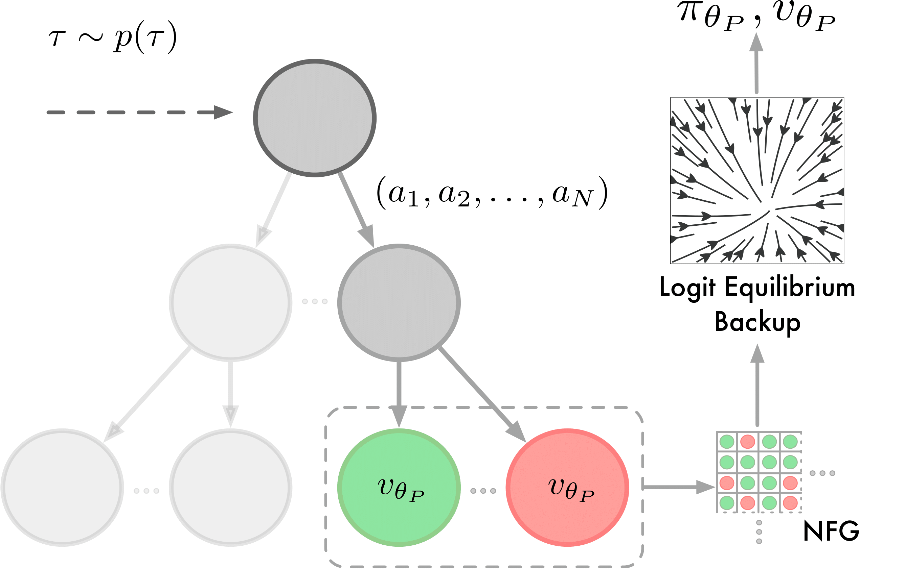
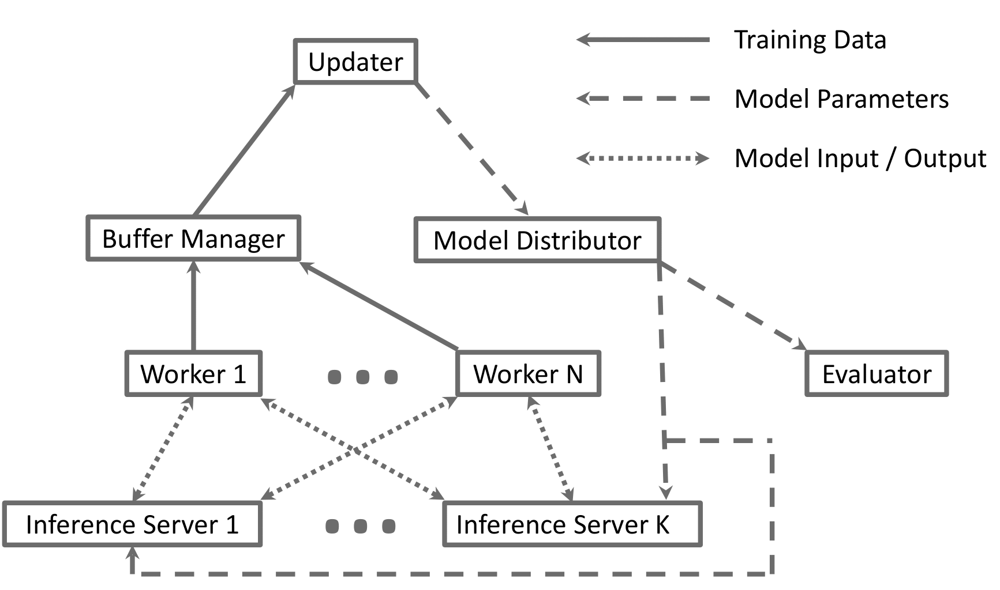

# Albatross

This Repo contains Code and trained Models for the Paper "Mastering Zero-Shot Interactions in Cooperative and Competitive Simultaneous Games"

<p align="center">
  
  <br>
  <em>Interpretation of Albatross by Midjourney</em>
</p>

## Technical Overview of Albatross
<p align="center">
  
  
  <br>
  <em>Training architecture of the proxy and response models of Albatross. Both models are trained via planning-augmented self-play using fixed-depth search and are conditioned on one (proxy model) or multiple (response model) temperatures tau that are drawn from a distribution p(tau). The response model uses the trained proxy model to compute the Smooth Best Response Logit Equilibrium (SBRLE).</em>
</p>

## Multiprocessing Framework

<p align="center">
  
  <br>
  <em>Multiprocessing framework</em>
</p>
The training framework of Albatross is a multiprocessing framework. An update process is responsible for updating the parameters of the neural network by performing a forward and backward pass. The new model parameters are sent to a distribution process, which in turn sends the new parameters to multiple other processes. It sends the parameters to an evaluation process, which evaluates an agent using these parameters against the baseline agent. Additionally, the distribution process sends the parameters to a saver, which saves the model checkpoints at fixed intervals for later evaluation. Lastly, the parameters are distributed to all worker processes. The worker processes perform self-play and evaluate game states using tree search. For evaluating nodes in the search tree, observations of the game states are sent to inference servers, which perform the model forward passes. This evaluation yields training data, which is send to a collection process. For experiments using data augmentation, the augmentation regarding symmetries is performed in the worker process. The collection process stores the new training data in the replay buffer. Additionally, the collection process samples batches of training data from the replay buffer and sends it to the update process. The update process uses these batches for updating the neural network. Additionally, all processes are connected to a separate logging process, which is not included in the figure for better visibility. The logging process collects statistics and data, which is processed using Weights and Biases.


## Installation

#### Compile C++ Module
Firstly, it is necessary to compile the c++ modules as most algorithms and game dynamics are implemented in that language.
For this purpose, you need a g++ compiler on your system (for C++ version 11).
```
# Windows
cd src/cpp/alglib
cmd < compile.bat
cd ..
cmd < compile.bat

# Linux
cd src/cpp/alglib
sh compile.sh
cd ..
sh compile.sh
```

#### Create a Mamba environment
This may take a while
```
mamba env create -f environment.yml
```
#### Update environment (if env exists)
```
mamba env update -f environment.yml
```

#### Install Cuda if necessary/possible
```
mamba activate battlesnake-rl
pip uninstall pytorch
mamba install pytorch-cuda==11.7 cudatoolkit pytorch==2.0.1 torchvision -c pytorch -c nvidia
```

#### Activate environment
```
mamba activate battlesnake-rl
```


## Folder Structure
* overcooked_ai_py: Overcooked Environment from ([Carrol et al.](https://github.com/HumanCompatibleAI/overcooked_ai)). Used for comparison with our internal C++ Implementation of Overcooked
* scripts: Python Scripts for generating training configs, tournament evaluations and plots of the results
* imp_env: Unused, RL-Environment for infrastructure management (https://github.com/moratodpg/imp_marl)
* test: Extensive Unittests. Mirrors the folder structure of src
* trained_models/bc_state_dicts: trained pytorch models / behavior cloning agents
* src: 
  * agent: Interface and implementation of agents playing a game
  * analysis: GUI for displaying neural network predictions in the game of Battlesnake
  * cpp: C++ Library for Battlesnake/Overcooked game and various game theoretic algorithms
  * depth: Code for parallel evaluation of different tree search depths
  * equilibria: Python interface for game theoretic algorithms. Internally calls the C++ code.
  * game: Game interface
    * battlesnake: BattleSnake game
    * normal_form: Normal form games and random initialization
    * overcooked: Game of Overcooked implemented in C++
    * overcooked_slow: Original implementation of Overcooked in Python, same game dynamics
  * misc: Various code snippets for multiprocessing, plotting or training
  * modelling: Maximum likelihood estimation interface, internally calls C++ library
  * network: Neural Network Architectures, notably ResNet, MobileNetV3 and MobileOne
  * search: Interface for different Search algorithms. Notable implementations are MCTS, Fixed Depth Search, Iterative Deepening and SM-OOS. All variants have standard interface for selection, expansion, backup and extraction functions.
  * supervised: Code for supervised training. Includes optimization, loss computation and annealing.
  * trainer: Parallelized training framework for reinforcement learning. See description above.


## Usage of Trained Models
All of the trained Albatross and AlphaZero models can be found in the "trained_models" folder. For overcooked, we use the following naming abbreviations:
* aa: Asymmetric Advantage
* cc: Counter Circuit
* fc: Forced Coordination
* co: Coordination Ring
* cr: Cramped Room

The battlesnake models are abbreviated by the scheme "{Number of Players}{(non)-deterministic}{grid_size}".
You can create an Agent with a trained Albatross-Model in the following manner:

```
net_path = Path(__file__).parent / 'trained_models' / 'battlesnake'
seed = 0
resp_path = net_path / f'4nd7_resp_{seed}.pt'
proxy_path = net_path / f'4nd7_proxy_{seed}.pt'

net = get_network_from_file(resp_path)
alb_network_agent_cfg = NetworkAgentConfig(
    net_cfg=net.cfg,
    temperature_input=True,
    single_temperature=False,
)
alb_online_agent_cfg = AlbatrossAgentConfig(
    num_player=4,
    agent_cfg=alb_network_agent_cfg,
    device_str='cpu',
    response_net_path=str(resp_path),
    proxy_net_path=str(proxy_path),
    noise_std=None,
    num_samples=1,
    init_temp=5,
)
alb_online_agent = AlbatrossAgent(alb_online_agent_cfg)
```

Games are also created by specifying a game config and the creating the game. Most game modes have a predefined game config (see src/game/battlesnake/bootcamp), but feel free to create new game modes as desired:
```
game_cfg = survive_on_7x7_4_player()
game = get_game_from_config(game_cfg)
```

Baseline-Search agents can be used for evaluation and are constructed as:
```
base_agent_cfg = AreaControlSearchAgentConfig()
base_agent_cfg.search_cfg.eval_func_cfg = SymmetricAreaControlEvalConfig()
base_agent = get_agent_from_config(base_agent_cfg)
```

In the "scripts"-folder, you can find many examples on how to use the Albatross-Agents. Additionally, there are examples on how to train Albatross, if you want to use it in different games. This might require writing a wrapper for the new game, which adheres to the Game interface in this repository (see src/game/game.py)


